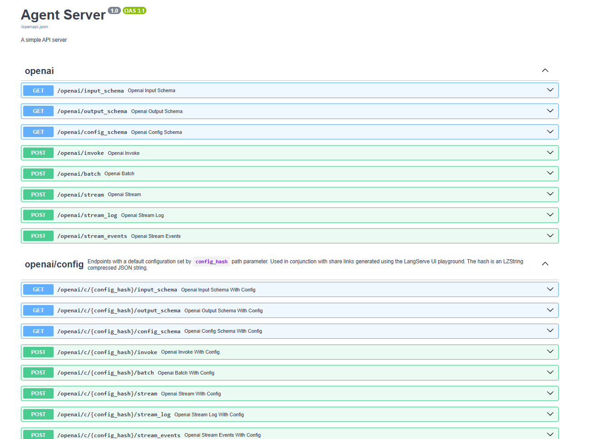
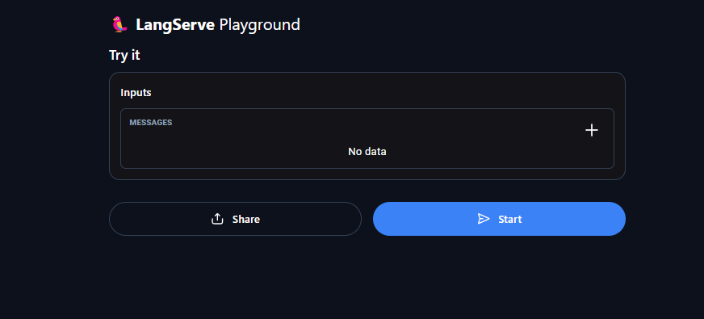

# Agent Server

## Overview

Agent Server is a FastAPI-based application designed to interact with language models using `langchain` and `langgraph` libraries. It provides an API for generating Python code solutions based on user queries and includes a workflow that checks and reflects on the generated code's correctness. The server integrates `langserve` for easy deployment of the language model and workflow.

## Features

- **Chat-based Code Generation**: Uses a predefined prompt to generate Python code based on user queries.
- **Streaming API**: Real-time streaming responses for interactive chat applications.
- **Deploying Agents**: LangServe offers a playground for users to make queries and obtain generated code.
- **Code Execution and Validation Funtions**: Generates, executes, and validates code function calling.
- **Reflective Workflow Function**: Analyzes and provides reflections on code generation errors.
- **Cross-Origin Resource Sharing (CORS)**: Enabled for flexibility in accessing the API.

## Prerequisites

- **Python 3.8+**
- **FastAPI**
- **Uvicorn**
- **langchain**
- **langserve**
- **OpenAI API Key**

## Installation

1. **Clone the repository:**

   ```bash
   git clone <https://github.com/Workforce-41/production-manager-agent/tree/main>
   cd <production-manager-agent>

2. **Create a Clean Virtual Environment:**

    python -m venv myenv

3. **Install dependencies:**

    pip install -r requirements.txt

4. Set the environment variable in a .env file:

    OPENAI_API_KEY = <YOUR API KEY>

## API Endpoints

1. **/openai**

Description: Endpoint for interacting with the language model.
Method: POST

2. **/chain**
Description: Endpoint for code generation using a LangChain model.
Method: POST

3. **/stream_chat/**
Description: Streaming endpoint for real-time chat responses.
Method: POST
Request Body: JSON object containing messages (string)

4. **/agents**
Description: Workflow endpoint for generating, validating, and reflecting on code solutions.
Method: POST

**Example Request**
To send a request to the /stream_chat/ endpoint:

    json
    {
    "messages": "How can I implement a bubble sort algorithm in Python?"
    }

**Agent Server**:
Follow the link after running app.py: http://localhost:8000/docs


**Deployed Agent**:
Follow the link after running app.py: http://localhost:8000/agents/playground/

